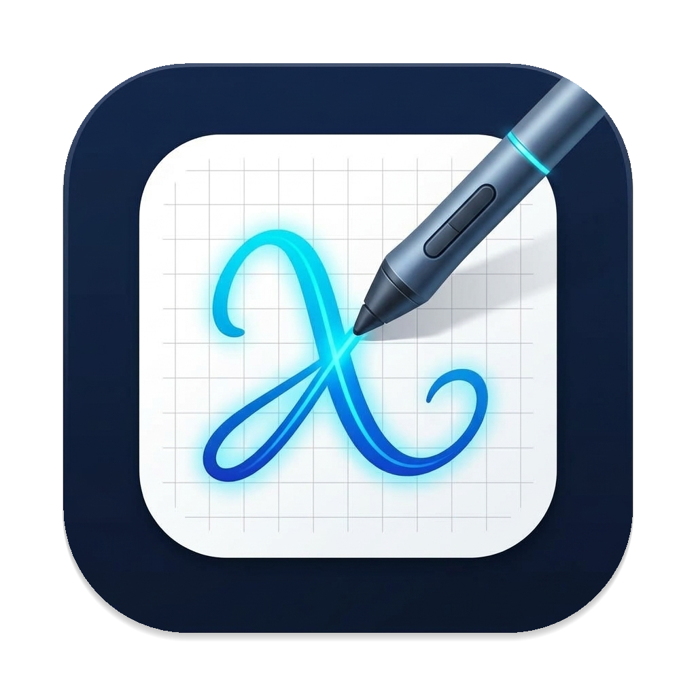
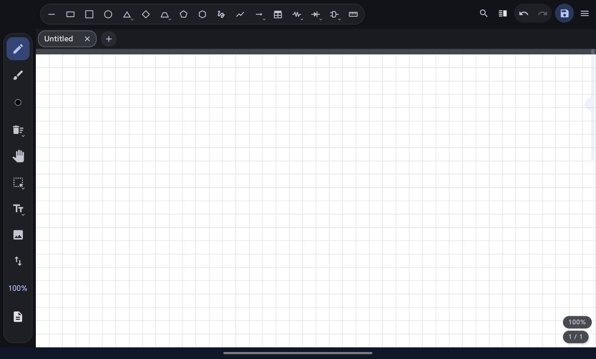

<div align="center">
  

  # MobiXournal
  **A stylus-first Xournal++ (`.xopp`) editor & STEM companion for Android — with full graphics tablet support & ExpressKey shortcuts**

  [](https://github.com/amarzano2005/MobiXournal/actions/workflows/build.yml)
  [](LICENSE)
  [](https://android.com)
  [-orange)](https://github.com/xournalpp/xournalpp)
  []()

  <br />

  
</div>

**MobiXournal** is an open-source Android app designed for handwritten notes, sketching, and technical documentation using the native [Xournal++](https://github.com/xournalpp/xournalpp) (`.xopp`) format, with first-class support for active styluses, graphics tablets (Wacom, Huion, XP-Pen), and configurable hardware shortcuts.

The primary goal is **100% format fidelity and round-trip safety**: files edited on Android reopen identically in desktop Xournal++ on Linux, macOS, or Windows without losing strokes, layers, backgrounds, or metadata.

In addition to core note-taking, MobiXournal features a specialized **STEM toolset** (electronic circuits, IEEE logic gates, relational schema tables, coordinate systems, parametric splines, virtual drafting instruments, and on-device LaTeX rendering) saved as standard vector strokes.

> **Credits & License**:
> - **Xournal++**: Format handling, palette, and shape recognition are derived from or matched to [Xournal++](https://github.com/xournalpp/xournalpp) (GPL-2.0-or-later).
> - **NeXopp**: MobiXournal is a continuation and rebranding of [NeXopp](https://github.com/bamonroe/NeXopp) by Brian Monroe (`bamonroe`).
> - This project is independent and unofficial, distributed under the **GPL-2.0-or-later** license. See [`LICENSE`](LICENSE) and [`NOTICE`](NOTICE).

---

## 📚 Documentation Map

MobiXournal follows a hub-and-spoke documentation model:

| Topic | Document |
|---|---|
| **Development & Conventions** | [`AGENTS.md`](AGENTS.md) |
| **System Architecture & .xopp Schema** | [`docs/architecture.md`](docs/architecture.md) |
| **Build Tools, Container & Emulator** | [`docs/tools.md`](docs/tools.md) |
| **Active Tasks & Roadmap** | [`TODO.toml`](TODO.toml) (via `scripts/todo.sh list`) |
| **Completed Work Archive** | [`FINISHED.toml`](FINISHED.toml) |

---

## 🛠️ Build & Requirements

### Requirements
- **Docker** (all builds run in a containerized Android toolchain; no local JDK, SDK, or Gradle needed).
- KVM support (optional, for headless emulator testing).

### Build Commands
```sh
# Full build: unit tests + debug APK
scripts/build.sh

# Run JVM unit tests only (instant, no device needed)
scripts/build.sh testDebugUnitTest

# Clean release-path build of the debug APK
scripts/build.sh clean assembleDebug
```
For emulator installation, deployment, and testing harnesses, refer to [`docs/tools.md`](docs/tools.md).

---

## 📖 User Guide

### 📂 Workspace & Documents

- **Multi-Tab Interface**: Work with multiple documents simultaneously. Each tab preserves its own viewport, zoom, page position, and history. Tabs can be dragged to reorder.
- **Split View & Live Mirroring**:
  - **Split View**: View and edit two different documents side by side with an adjustable divider.
  - **Mirrored View**: Open a second live view of the *same* document (e.g. view a reference diagram at the top while writing notes at the bottom). Changes sync immediately.
- **Tab Overview**: Tap the grid icon in the top bar to inspect all open tabs as thumbnail previews.
- **Session Restore**: Open tabs and unsaved drafts are cached locally and restored automatically on next launch.
- **Universal File Import**:
  - **`.xopp` / `.xopp.gz`**: Standard Xournal++ documents (both gzip and zipped single-file archives).
  - **PDF Documents**: Open or import any PDF for vector annotation. Choose **Replace** or **Append** (appends merge seamlessly into a single document).
  - **Plain Text & Markdown (`.txt`, `.md`)**: Automatically typeset into annotatable pages with rich headings, monospace code blocks, and lists. Text remains selectable and copyable.
  - **Images (`PNG`, `JPEG`, `WebP`)**: Opened as annotatable pages with the image as the background.
  - **System Integration**: MobiXournal registers as a document handler for `.xopp`, PDF, and images in the Android "Open with" / "Share" menu. Remote shares (WebDAV, Nextcloud, SSHFS) are supported via Storage Access Framework.

### 🖊️ Stylus & Drawing Experience

- **Stylus-First Input**:
  - **Palm Rejection**: Capacitive fingers only pan/zoom while the pen writes (finger drawing can be toggled on in settings).
  - **Pressure Sensitivity, Multiplier & Presets**: Dynamic line width matching desktop Xournal++ tapering curves. The two knobs are the desktop's own filter — **Minimum pressure** (the floor, 0.01 → 1.00) and **Pressure multiplier** (0.5 → 4.00×, so a light hand can thicken a stroke well past its size) — with customizable presets and editable names, adjustable on the fly via the top-bar overflow menu ("Pen parameters…") or in Settings → Stylus. With **Pressure sensitivity** switched off both controls are shown disabled with the reason, instead of silently doing nothing. **Pen diagnostics** prints the live filter and the raw pressure the tablet reports, so a value that never reaches the pen is visible rather than guessed at.
  - **Hover Preview**: S-Pen / Active Pen hover ring indicates exact tip contact point.
  - **Hardware Barrel Buttons**: Hold barrel button to erase or lasso select (supported on Android 14+ stylus buttons, Bluetooth pens, and mouse right-clicks). Double-click to undo or toggle tools.
- **Pen & Realistic Highlighter**:
  - **Pen**: Smooth vector strokes with digitizer wobble filtering and pressure dynamics.
  - **Highlighter**: Realistic multiply blending (~47% opacity) preserving ink visibility underneath. Standard desktop tip sizes (1 mm, 3 mm, 7 mm).
- **Precision Eraser**:
  - **Partial Eraser**: Splits strokes at contact boundaries.
  - **Whole-Stroke Eraser**: Deletes entire strokes touched by the tip.
  - Tip size adjusts with width slots; visual contact radius ring follows the cursor.
- **Color Palette & Stroke Width**:
  - 8 standard desktop Xournal++ colors in a fixed order — black, red, green, blue, orange, yellow, magenta, white — plus a custom HSV/hex picker.
  - 3 customizable width slots per tool (`S` / `M` / `L`).
  - Tools remember their own active color and stroke width independently.
  - Line styles: **Solid**, **Dashed**, **Dash-dot**, **Dotted**.
- **Layers**:
  - Full layer stack per page: add, reorder, rename, hide/show, merge down, and move selections between layers.

### 🔬 STEM & Technical Tools

MobiXournal includes a dedicated technical toolset engineered for science, engineering, and mathematics note-taking:

- **Electronic Circuits**:
  - Drag to place and orient passive components: **Resistors** (zigzag), **Capacitors** (parallel plates), **Inductors** (multi-loop coils), and **Earth Ground**.
- **IEEE Logic Gates**:
  - Full digital logic symbol library: **AND**, **NAND**, **OR**, **NOR**, **XOR**, **XNOR**, and **NOT (Inverter)** with standard input/output terminals and inversion bubbles.
- **Relational Database Tables**:
  - Interactive grid tables with dynamic row and column counters. The row counter counts **data** rows only; the optional header stacks one extra row above them instead of consuming a data row.
  - Optional **Relational Header** format (double line dividing attribute columns from data rows).
  - Drag to size or 1-tap center on viewport.
- **LaTeX Math Formulae**:
  - On-device formula editor with live preview.
  - Curated STEM symbol palette for fast symbol insertion: Calculus integrals/differentials, Greek letters, algebraic operators, and physics shortcuts.
- **Geometry & Vectors**:
  - **Geometric Polygons & Shapes**: Squares, rhombuses, trapezoids, pentagons, hexagons, ellipses/circles, and rectangles.
  - **Triangles with Variants & Custom Angles**: Submenu with 4 geometric kinds: **Equilateral** (default, equal sides/angles), **Right-angled**, **Isosceles**, and **Scalene** with fully customizable interior angles (A, B, C; sum = 180°) and live preview.
  - **Trapezoid with Variants & Custom Angles**: Submenu with 3 kinds: **Isosceles** (default, shorter base centred over the longer one), **Right-angled** (one leg perpendicular to the bases), and **Scalene** with its two base angles customizable — unequal angles give unequal legs, i.e. four different sides — with live preview. The figure is always fitted inside its drag, and its angles are what is kept exactly.
  - **Cartesian Coordinate Axes**: Instant oriented X/Y coordinate systems.
  - **Vectors**: Single and double-ended arrows for force diagrams and dimensioning.
  - **Parametric Splines**: Multi-point smooth curves with interactive tangent handles.
- **Virtual Drafting Instruments**:
  - **Setsquare (30°/60°/90°)**: Movable drafting triangle with edge snapping for straight lines.
  - **Compass**: Circular guide with adjustable radius for arcs and circles.
  - **Protractor**: 180° scale with 5°/15° tick marks, straight diameter ruler, rim arc snapping, and 15° radial snapping.
- **Shape Recognition & Snapping**:
  - **Ported Recognizer**: Desktop Xournal++ algorithm snaps freehand strokes into lines, rectangles, triangles, and circles.
  - **Snap to Grid**: Snaps endpoints to graph, dotted, or ruled paper rulings.
  - **Snap Rotation**: 15° stepping for object rotation and drafting tools.

### 🛠️ Editing & Canvas Tools

- **Selection & Manipulation**:
  - **Rectangle & Lasso Selection**: Select active-layer objects.
  - **Transformations**: Move (with auto-scrolling at screen edges), uniform resize, and stroke rotation.
  - **Edge Auto-Scroll**: Dragging either a move or the rectangle/lasso marquee into the top or bottom edge scrolls the page vertically, so a selection can reach past the viewport (matching desktop Xournal++).
  - **Action Bar**: Cut, Copy, Paste (centers on visible viewport), Duplicate, Recolor, Change line weight, and Delete.
  - **Select Background (Flatten)**: Marquee-select a region to copy or cut a flattened raster image including all layers and page background.
- **PDF Text Selection**: Drag across vector PDF text to highlight and copy text to the system clipboard (no OCR needed).
- **Full-Document Search & Handwriting Recognition**:
  - Unified search across authored text boxes, background PDF text, and **handwritten ink strokes**.
  - On-device offline stroke handwriting recognition and indexing for both print and continuous cursive handwriting (ligature-based stroke segmentation).
  - Modern Material 3 search pill with dynamic match badge (`1/3` or `0/0`), auto-focus, keyboard Search action, quick clear button, and rounded canvas highlights with smooth navigation.
- **Vertical Space Tool**: Drag down to insert blank space across all layers simultaneously; drag up to close gaps.
- **Text & Images**: Insert resizable text boxes (Sans, Serif, Monospace, bold, italic, custom colors) and external bitmap images.
- **Synchronized Audio Notes**:
  - Record audio while handwriting. Strokes are tagged with precise timestamps (`fn`/`ts`).
  - Use the **Play Object** tool to tap any stroke and replay the audio recorded at that exact moment (stored as companion `.wav` files compatible with desktop Xournal++).
- **Page Management & Overview**:
  - **Page Layout**: Single-page stack or multi-column grid overview (**1, 2, 3, or 4 pages per row**).
  - **Page Grid Edit Mode**: Select, reorder by dragging, copy, paste, or delete entire pages.
  - **Background Rulings**: Plain, Lined, Ruled, Graph, and Dotted in standard Xournal++ colors.
  - **Page Dimensions**: Presets (A4, A5, Letter, Legal) or custom dimensions (mm, in, pt). Configurable default page size.

### ⚙️ Hardware Optimization & Settings

- **Graphics Tablets**:
  - Plug-and-play USB OTG and Bluetooth tablet support (Wacom, Huion, XP-Pen, Gaomon).
  - **1-Click ExpressKey Detection**: Map physical tablet buttons directly to tools and colors by pressing them in **Settings → Shortcuts**.
  - **Stylus Calibration**: Independent pressure multiplier (up to 4×) and minimum pressure floor (up to 1.00) — desktop Xournal++'s own ranges — plus precision budgets (Economy to Maximum).
- **Toolbars & Interface**:
  - **Top Bar**: One-tap **Save** (next to undo/redo), undo/redo, search, and **Split View** (right of the search button); the overflow menu holds the remaining file and pen actions.
  - **Dual Toolbar**: Optional secondary top bar showing frequently used tools without taking canvas space.
  - **Dockable Rail**: Tool rail can be docked to Left, Right, Top, or Bottom.
  - Reorder, hide, or show any tool slot.
- **Navigation & Scrolling**:
  - Configurable momentum scrolling (linear, quadratic, cubic, exponential curves) and panning sensitivity.
  - Distraction-free **Full-Page View** (double-tap canvas center with Hand tool to hide all chrome).
  - Fast scroll thumb with page number bubble; persistent page counter and zoom indicator (tap to reset to 100%).
- **Theming & Backups**:
  - Material 3 theme (System, Light, Dark) with optional Material You dynamic wallpaper colors (Android 12+).
  - Complete settings and custom palette export/import to standard JSON.

### 💾 Saving & Exporting

- **Cloud & Remote Storage**: Save and export PDF to any destination the system file picker offers, including cloud providers (Google Drive, OneDrive, Dropbox) and mounted remote shares. Every write is serialised to a local staging file first and pushed across in a single pass, so a slow or failed upload can never leave a half-written `.xopp` behind.
- **Save**: Writes directly to the open file without prompts.
- **Save As**:
  - **Original (`.xopp`)**: Standard gzip-compressed XML file with external PDF/image linking. Best for desktop interchange.
  - **Zipped (`.xopp`)**: Self-contained archive with PDFs and images bundled internally. Ideal for standalone sharing.
- **Export PDF**: Flattens annotations over vector backgrounds. Original vector PDFs remain crisp vectors without ballooning rasterization; bundled DejaVu fonts ensure accurate rendering across all PDF readers.

---

## 🏛️ Project Structure

The Kotlin source code is organized under `app/src/main/java/com/mobixournal/`:
- `format/`: `.xopp` XML parser, writer, models, and gzip/zip container handling.
- `render/`: Canvas rendering engine, stroke geometry, and STEM shape generators.
- `ui/`: Jetpack Compose Material 3 chrome, toolbars, settings, and dialogs.
- `io/`: Android Storage Access Framework (SAF), PDF background loading, and caching.
- `audio/`: Synchronized microphone recording and playback engine.
- `tabs/` & `panes/`: Multi-tab session cache and split-view management.

Full architectural details, data flow diagrams, and test suites are documented in [`docs/architecture.md`](docs/architecture.md).

---

## 📄 License

MobiXournal is free software licensed under the **GNU General Public License, version 2 or later** ([GPL-2.0-or-later](LICENSE)), matching upstream [Xournal++](https://github.com/xournalpp/xournalpp).

```
MobiXournal - Stylus-first Xournal++ editor for Android
Copyright (C) 2024-2026 amarzano2005
Based on NeXopp, Copyright (C) 2023-2024 Brian Monroe
Based on Xournal++, Copyright (C) 2018-2026 The Xournal++ Team
```
